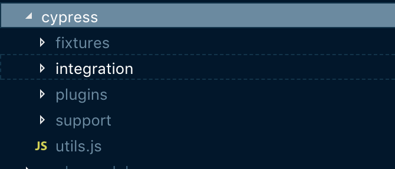

# End to end testing with [Cypress.io](https://www.cypress.io/)

## Setting up Cypress on the repo

1. install cypress as devDependency `npm install -D cypress`
2. at `package.json` add script `"cy:open": "cypress open"`
3. on your terminal run `npm run cy:open`

## Adding test

1. cypress will automatically create folders



2. we will put our tests in `integration` folder
3. cypress has methods that first require us to pass a handler like ID, class or a customized attribute

example

```javascript
cy.registerNewUser().then(() => {
    cy.visit('/')
        .contains('Become a Host')
        .click()
        .get('input[id="officeName"]')
        .type('Merge Sort Center')
})
```

`cy.visit('/')` is a method to point cypress what URL it will test
\
\
cypress methods are chainable means these two implementation will operate just the same

\
chain
```
cy.contains('Become a Host')
  .click()
  .get('input[id="officeName"]')
  .type('Merge Sort Center')
```

\
new line
```
cy.contains('Become a Host').click()
cy.get('input[id="officeName"]').type('Merge Sort Center')
```

\
`registerNewUser` is a support command I created to simulate registration of a new user

```javascript
Cypress.Commands.add('registerNewUser', () => {
    const user = registerForm();
    const authUrl = 'http://localhost:3000/api/signup';

    return cy
        .log('resigter a test new user', user)
        .request('POST', authUrl, user)
        .then(({ body }) => {
            client.writeData({
                data: {
                    activeUser: {
                        ...body.user,
                        __typename: 'ActiveUser',
                    },
                    visibleModal: null,
                },
            });
            return Object.assign({}, body.user);
        });
});
```
\
[Check out their docs to try more commands and assertions](https://docs.cypress.io/api/api/table-of-contents.html)

\
## Testing our components in Laguro

Components we made out of html elements (using JSX) are not that hard to test in cypress. We can see above that we need to pass a unique identifier to cypress methods to gain a handler and simulate DOM events.
