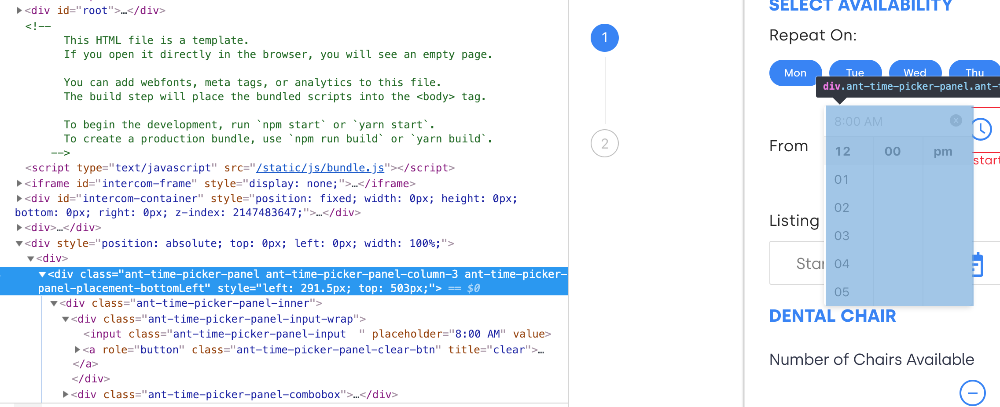

# End to end testing with [Cypress.io](https://www.cypress.io/) --- Host Onboarding

## Setting up Cypress on the repo

1. install cypress as devDependency `npm install -D cypress`
2. at `package.json` add script `"cy:open": "cypress open"`
3. on your terminal run `npm run cy:open`

## Adding test

1. cypress will automatically create folders


2. we will put our tests in `integration` folder
3. cypress has methods that first require us to pass a handler like ID, class or a customized attribute

example

```javascript
cy.registerNewUser().then(() => {
  cy.visit("/")
    .contains("Become a Host")
    .click()
    .get('input[id="officeName"]')
    .type("Merge Sort Center");
});
```

`cy.visit('/')` is a method to point cypress what URL it will test
\
\
cypress methods are chainable means these two implementation will operate just the same

\
chain

```javascript
cy.contains("Become a Host")
  .click()
  .get('input[id="officeName"]')
  .type("Merge Sort Center");
```

\
new line

```javascript
cy.contains("Become a Host").click();
cy.get('input[id="officeName"]').type("Merge Sort Center");
```

\
`registerNewUser` is a support command I created to simulate registration of a new user

```javascript
Cypress.Commands.add("registerNewUser", () => {
  const user = registerForm();
  const authUrl = "http://localhost:3000/api/signup";

  return cy
    .log("resigter a test new user", user)
    .request("POST", authUrl, user)
    .then(({ body }) => {
      client.writeData({
        data: {
          activeUser: {
            ...body.user,
            __typename: "ActiveUser",
          },
          visibleModal: null,
        },
      });
      return Object.assign({}, body.user);
    });
});
```

\
[Check out their docs to try more commands and assertions](https://docs.cypress.io/api/api/table-of-contents.html)

## Testing our components in Laguro

- Components we made out of html elements (using JSX) are not that hard to test in cypress.
- We can see above that we need to pass a unique identifier to cypress methods to gain a handler and simulate DOM events.
- We just need to pass a unique ID, class or customized attribute to our JSX and cypress methods then cypress testing will be so smooth.
- [Check this part of the docs for the best practice in selecting elements](https://docs.cypress.io/guides/references/best-practices.html#Selecting-Elements)

### Testing 3rd-party React Components ---> this is where challenge and pain come in

#### AntD Components

- components are deeply nested
- automatically assigning `id` using `name` attribute we provide to form fields
- most of the time the element you need is not exposed

#### deeply nested time picker component


#### target component rendered outside the root `div`



#### `div` exposed has no event listener attached


#### `div` we need with listener is buried deep in the DOM tree


Solution

```javascript
Cypress.Commands.add("addNewListing", (start, end, dateStart, dateEnd) => {
  return cy
    .get('input[id="startTime0"]')
    .click({ force: true })
    .get('input[class="ant-time-picker-panel-input  "]')
    .first()
    .type(start, { force: true, timeout: 1000 })
    .get('input[id="endTime0"]')
    .click({ force: true })
    .get('input[class="ant-time-picker-panel-input  "]')
    .last()
    .type(end, { force: true, timeout: 1000 })
    .get('div[class="sc-csuQGl jttbwb"]')
    .first()
    .click({ force: true })
    .get(`td[title="${dateStart}"]`)
    .click()
    .get(`td[title="${dateEnd}"]`)
    .click()
    .get('input[id="hourlyChairPrice0"]')
    .type("1000", { force: true })
    .get('input[id="cleaningFee0"]')
    .type("1000", { force: true })
    .get("[data-cy=host-submit]")
    .submit({ force: true })
    .get("[data-cy=host-submit]")
    .submit({ force: true });
});
```

#### FileStack React Components

- cypress will not recognize any input element lower than `1px` both height and width, filstack input component is only `0.9px`
- there is no mousedown and mouseup listener, drag n drop is not possible to simulate in cypress

#### drop area but do not have mousedown and mouseup listener


#### input fileupload element with onchange and onclick listener


Solution

```javascript
Cypress.Commands.add("uploadFile", (selector, fileUrl, type = "") => {
  return cy.get(selector).then(subject => {
    return cy
      .fixture(fileUrl, "base64")
      .then(Cypress.Blob.base64StringToBlob)
      .then(blob => {
        return cy.window().then(win => {
          const el = subject[0];
          const nameSegments = fileUrl.split("/");
          const name = nameSegments[nameSegments.length - 1];
          const testFile = new win.File([blob], name, { type });
          const dataTransfer = new DataTransfer();
          dataTransfer.items.add(testFile);
          el.files = dataTransfer.files;
          return subject;
        });
      });
  });
});
```

[API Reference for Cypress Window](https://docs.cypress.io/api/commands/window.html#Syntax)
